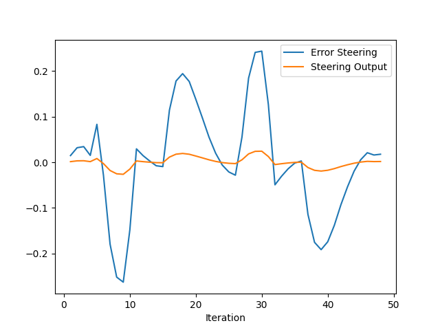

# Control and Trajectory Tracking for Autonomous Vehicle

# Proportional-Integral-Derivative (PID)

In this project, a self-designed PID controller is implemented to perform vehicle trajectory tracking. Given a trajectory as an array of locations, and a simulation environment, this PID controller and its efficiency is tested on the CARLA simulator used in the industry.

### Installation

Run the following commands to install the starter code in the Udacity Workspace:

Clone the <a href="https://github.com/udacity/nd013-c6-control-starter/tree/master" target="_blank">repository</a>:

`git clone https://github.com/udacity/nd013-c6-control-starter.git`

## Run Carla Simulator

Open new window

* `su - student`
// Will say permission denied, ignore and continue
* `cd /opt/carla-simulator/`
* `SDL_VIDEODRIVER=offscreen ./CarlaUE4.sh -opengl`

## Compile and Run the Controller

Open new window

* `cd nd013-c6-control-starter/project`
* `./install-ubuntu.sh`
* `cd pid_controller/`
* `rm -rf rpclib`
* `git clone https://github.com/rpclib/rpclib.git`
* `cmake .`
* `make` (This last command compiles your c++ code, run it after every change in your code)

## Testing

To test your installation run the following commands.

* `cd nd013-c6-control-starter/project`
* `./run_main_pid.sh`
This will silently fail `ctrl + C` to stop
* `./run_main_pid.sh` (again)
Go to desktop mode to see CARLA

If error bind is already in use, or address already being used

* `ps -aux | grep carla`
* `kill id`


## Project Instructions

In the previous project a path planner is built for the autonomous vehicle. Now the steer and throttle controller are built here so that the car follows the trajectory.

In the directory [/pid_controller](https://github.com/udacity/nd013-c6-control-starter/tree/mathilde/project_c6/project/pid_controller)  you will find the files [pid.cpp](https://github.com/udacity/nd013-c6-control-starter/tree/mathilde/project_c6/project/pid_controller/pid.cpp)  and [pid.h](https://github.com/udacity/nd013-c6-control-starter/tree/mathilde/project_c6/project/pid_controller/pid.h). This is where pid controller is implemented.
The function pid is called in [main.cpp](https://github.com/udacity/nd013-c6-control-starter/tree/mathilde/project_c6/project/pid_controller/main.cpp).

### Step 1: Build the PID controller object
Check [pid_controller.h](https://github.com/udacity/nd013-c6-control-starter/tree/mathilde/project_c6/project/pid_controller/pid_controller.h) and [pid_controller.cpp](https://github.com/udacity/nd013-c6-control-starter/tree/mathilde/project_c6/project/pid_controller/pid_controller.cpp).

Run the simulator and see in the desktop mode the car in the CARLA simulator. The car should not move in the simulation.
### Step 2: PID controller for throttle:
In [main.cpp](https://github.com/udacity/nd013-c6-control-starter/tree/mathilde/project_c6/project/pid_controller/main.cpp), the error for the throttle pid is computed. The error is the speed difference between the actual speed and the desired speed.

### Step 3: PID controller for steer:
1) In [main.cpp](https://github.com/udacity/nd013-c6-control-starter/tree/mathilde/project_c6/project/pid_controller/main.cpp), the error for the steer pid is computed. The error is the angle difference between the actual steer and the desired steer to reach the planned position.

2) The angle betweeen the last two points on the trajectory is being used as the desried steer to compute the steer error.

3) A alternative method `find_closest_point` is implemented in `main.cpp`, and used to find a point on the planned trajectory, that is closest to the current vehicle position. The yaw of this point is the desired steer. This method is not used for the test, but can be studied later.

4) Tune the parameters of the pid until satisfying results are obtained (a perfect trajectory is not expected).

### Step 4: Evaluate the PID efficiency
The values of the error and the pid command are saved in thottle_data.txt and steer_data.txt.
Plot the saved values using the command (in nd013-c6-control-refresh/project):

```
python3 plot_pid.py
```

## Results
### Carla simulator


### Video of PID controller in Carla simulator
https://user-images.githubusercontent.com/25489053/172026600-b1de17f8-8d45-495e-b48d-0016873e08cd.mov


## Questions:
### 1. Add the plots to your report and explain them (describe what you see)
### PID Tests
|  TEST  | KP_STEER | KI_STEER | KD_STEER | KP_THROTTLE | KI_THROTTLE | KD_THROTTLE |
|:------:|:--------:|:--------:|:--------:|:-----------:|:-----------:|:-----------:|
|Reference|  0.10   |   0.00   |   0.00   |     0.10    |    0.00     |     0.00    |
| Test 1 |   0.25   |   0.001  |   0.25   |     0.2     |    0.001    |     0.10    |
| Test 2 |   0.40   |   0.01   |   0.25   |     0.2     |    0.01     |     0.15    |
| Test 3 |   0.40   |   0.01   |   0.25   |     0.2     |    0.15     |     0.15    |
| Test 4 |   0.25   |   0.02   |   0.40   |     0.2     |    0.01     |     0.3     |
| Test 5 |   0.40   |   0.02   |   0.40   |     0.2     |    0.01     |     0.3     |
| Test 6 |   0.50   |   0.02   |   0.25   |     0.2     |    0.01     |     0.15    |
| Test 7 |   0.60   |   0.02   |   0.25   |     0.2     |    0.01     |     0.15    |
### Plots
|TEST|STEER|THROTTLE|
|:--:|:---:|:------:|
Reference|| 
Test 1| | 
Test 2| | 
Test 3| | 
Test 4| | 
Test 5| | 
Test 6| | 
Test 7| | 

### Observation
- By comparing the plots of reference test with other tests, we can see that increasing `K_I` and `K_D` significantly reduces the steer errors and throttle errors.
- From plots of test 4 and test 5, test 6 and test 7, we can conclude that increasing `K_P` of steer control reduce the steer error.
- Throttle control in general is unstable in all conditions.
- Large `K_I` of throttle results large throttle error (test 3). Small `K_I` around `O(1e-3) - O(1e-2)` would be ideal.


### 2. What is the effect of the PID according to the plots, how each part of the PID affects the control command?
- Proportional term `P`: a value that is proportional to the current error. Large `P` value will result in a large change in the control output. 
- Integreal term `I`: a value that is proportional to the cumulative error over time. `I` term speeds up the process of movement to the setpoint and eliminates the residual steady state error produced by the system bias, which cannot be eliminated by a pure proportional controller.
- Derivative term `D`: a value that is proportional to the rate of change of error over time. `D` term predicts system behavior and thus improves the settling time and stability of the controller.
We can see the effects of the three terms from the plots above.
### 3. How would you design a way to automatically tune the PID parameters?
The "Twiddle algorithm" or "coordinate ascent" algorithm can continuously tune the parameters of PID controller by comparing cross-track errors.
### 4. PID controller is a model free controller, i.e. it does not use a model of the car. Could you explain the pros and cons of this type of controller?
From the expriments, we can see PID has two main advantages
- PID can be used and has decent performance when there is no model available
- Easy to implement and compute, making it suitable to run basic platforms
However, PID might have poor performance since it only uses single reference point

### 5. What would you do to improve the PID controller?
- Use Twiddle algorithm to fine tune PID automatically


